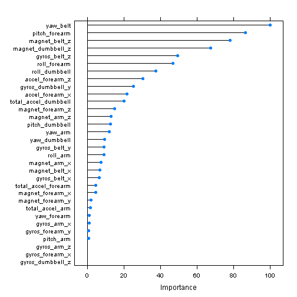
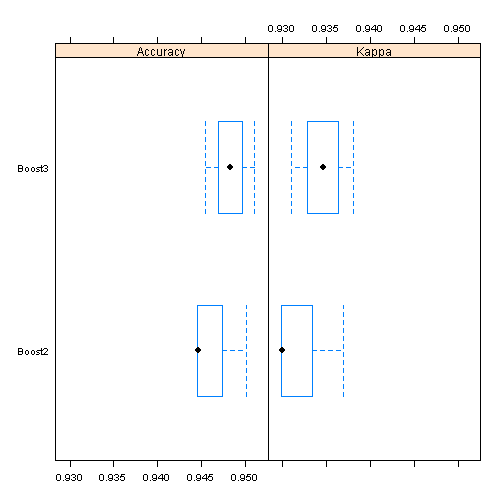

Weight Lifting Form Prediction using the Weight Lifting Exercises Dataset
========================================================

## Overview

A data set featuring movement data obtained through activity monitors is analyzed and used to predict weight lifting form on a particular dumbbell exercise performed by six individuals (i.e., qualitative activity recognition).  The data set is cleaned in various ways, and then boosted models are built for exercise form prediction.  Using cross-validation with these models, the out-of-sample error is estimated at approximately 5 percent.

## Preliminary Analysis and Processing

The training data set is read in, and it is seen that each of the five classes for exercise form (A through E, with A signifying correct form and B through E each signifying a particular error in form) are well represented; this balance is beneficial for this analysis on the whole.

Variables including "kurtosis," "skewness," "max," "min," "amplitude," "var," "avg," and "stddev" are removed from the data set based on missing values, "div/0"" values, and the transformed nature of these variables. Index and identifier variables are removed as well.  Variables showing near zero variance are searched for for removal, as such variables do not contain much predictive power, but none remain after previous cleaning. For purposes of increased model accuracy, Variables are also removed from the data set based on high absolute correlations, in this instance those of 0.75 or higher.


```r
library(caret) ## For model training

## Read in training data
setwd("C:/Users/swojciechowski/Desktop/CourseraMachineLearning/MachLearnProj")
trainDf <- read.csv("pml-training.csv")
## trainDf <- read.csv("https://d396qusza40orc.cloudfront.net/predmachlearn/pml-training.csv")

## Counts of exercise form observations, by form class
table(trainDf$classe)
```

```
## 
##    A    B    C    D    E 
## 5580 3797 3422 3216 3607
```

```r
## Set pattern for column name searching to later remove kurtosis, skewness, max_, min_, amplitude, var, avg, and stddev variables and data
pattern <- "kurtosis_|skewness_|max_|min_|amplitude_|var_|avg_|stddev"

## Remove kurtosis, skewness, max, min, amplitude, var, avg, and stddev variables and data
trainDfFiltered <- trainDf[, -(grep(pattern, names(trainDf), ignore.case = TRUE))]

## Remove index variables and indenifiers
trainDfFiltered <- trainDfFiltered[, -c(1:7)]

## Check for near zero Variance
nzvNoMet <- nearZeroVar(trainDfFiltered, saveMetrics = FALSE)
nzvNoMet
```

```
## integer(0)
```

```r
## Check for correlated predictors and remove from data set

trainDfFilteredCorr <- cor(trainDfFiltered[, -53]) ## Column 53 is classe variable
highCorr <- findCorrelation(trainDfFilteredCorr, 0.75)
trainDfFiltered <- trainDfFiltered[, -highCorr]
```

## Prediction Models

A boosted model is built and trained, with the results then considered.  The boosted model was chosen due to the classification nature of the problem and the model's high performance, as well as processing power and time considerations.

The results from the trained model indicate that three variables have zero influence on the model, so the relative importance of the variables included in the model is plotted.  A new data set is then built with the three variables having no importance removed, and a second boosted model is then trained on that reduced data set.


```r
## Build boosted model using training data
set.seed(1910)
modFitBoost2 <- train(classe ~ ., data = trainDfFiltered, method = "gbm", verbose = FALSE, 
                trControl = trainControl(method = "CV", number = 3))

## First model results
modFitBoost2
```

```
## Stochastic Gradient Boosting 
## 
## 19622 samples
##    32 predictor
##     5 classes: 'A', 'B', 'C', 'D', 'E' 
## 
## No pre-processing
## Resampling: Cross-Validated (3 fold) 
## 
## Summary of sample sizes: 13081, 13080, 13083 
## 
## Resampling results across tuning parameters:
## 
##   interaction.depth  n.trees  Accuracy   Kappa      Accuracy SD
##   1                   50      0.7123649  0.6355245  0.008158144
##   1                  100      0.7793291  0.7207091  0.004576204
##   1                  150      0.8115377  0.7615802  0.005173169
##   2                   50      0.8268787  0.7808162  0.008121695
##   2                  100      0.8797268  0.8478267  0.004369517
##   2                  150      0.9102025  0.8863736  0.003698798
##   3                   50      0.8720315  0.8380226  0.006060572
##   3                  100      0.9229947  0.9025620  0.002905119
##   3                  150      0.9464376  0.9322334  0.003224790
##   Kappa SD   
##   0.010276381
##   0.005724701
##   0.006538567
##   0.010280947
##   0.005513224
##   0.004672317
##   0.007630119
##   0.003661732
##   0.004081625
## 
## Tuning parameter 'shrinkage' was held constant at a value of 0.1
## Accuracy was used to select the optimal model using  the largest value.
## The final values used for the model were n.trees = 150,
##  interaction.depth = 3 and shrinkage = 0.1.
```

```r
modFitBoost2$finalModel
```

```
## A gradient boosted model with multinomial loss function.
## 150 iterations were performed.
## There were 32 predictors of which 29 had non-zero influence.
```

```r
modFitBoost2$resample
```

```
##    Accuracy     Kappa Resample
## 1 0.9445124 0.9298058    Fold2
## 2 0.9446399 0.9299487    Fold3
## 3 0.9501605 0.9369457    Fold1
```

```r
## Determine and plot first model variable importance
ImpBoost2 <- varImp(modFitBoost2)
plot(ImpBoost2)
```

 

```r
## Build new data set with zero importance variables removed
trainDfFilteredBoost <- subset(trainDfFiltered, select=-c(12, 20, 26))

## Build new boosted model using training data and new data set with zero importance 
## variables removed
set.seed(1910)
modFitBoost3 <- train(classe ~ ., data = trainDfFilteredBoost, method = "gbm", 
                verbose = FALSE, trControl = trainControl(method = "CV", number = 3))
```

## Out-of-Sample Error Estimates

In order to obtain estimates of out-of-sample error and gauge how well the model will perform on an unseen data set, 3-fold cross-validation is used from within the train() and trainControl() functions featured in the R Caret package. This choice was made based on the robustness of the technique as well as train-time considerations given the size of the training data set.

The model output for the second model, as well as plots of accuracy and kappa for both models are featured below.  It is seen from this that the out-of-sample error estimates indicated by the models are approximately 5 percent, with the second model performing somewhat better than the first.


```r
## Second model results
modFitBoost3
```

```
## Stochastic Gradient Boosting 
## 
## 19622 samples
##    29 predictor
##     5 classes: 'A', 'B', 'C', 'D', 'E' 
## 
## No pre-processing
## Resampling: Cross-Validated (3 fold) 
## 
## Summary of sample sizes: 13081, 13080, 13083 
## 
## Resampling results across tuning parameters:
## 
##   interaction.depth  n.trees  Accuracy   Kappa      Accuracy SD
##   1                   50      0.7123649  0.6355245  0.008158144
##   1                  100      0.7769848  0.7177423  0.003862842
##   1                  150      0.8111810  0.7611247  0.003676180
##   2                   50      0.8278975  0.7820951  0.007121690
##   2                  100      0.8823769  0.8511623  0.005461169
##   2                  150      0.9109162  0.8872618  0.002873193
##   3                   50      0.8722355  0.8382699  0.007758832
##   3                  100      0.9230969  0.9026872  0.004399667
##   3                  150      0.9482725  0.9345577  0.002824330
##   Kappa SD   
##   0.010276381
##   0.004824245
##   0.004613390
##   0.009070107
##   0.006909702
##   0.003621587
##   0.009776043
##   0.005555372
##   0.003577353
## 
## Tuning parameter 'shrinkage' was held constant at a value of 0.1
## Accuracy was used to select the optimal model using  the largest value.
## The final values used for the model were n.trees = 150,
##  interaction.depth = 3 and shrinkage = 0.1.
```

```r
modFitBoost3$finalModel
```

```
## A gradient boosted model with multinomial loss function.
## 150 iterations were performed.
## There were 29 predictors of which 29 had non-zero influence.
```

```r
modFitBoost3$resample
```

```
##    Accuracy     Kappa Resample
## 1 0.9454295 0.9309541    Fold2
## 2 0.9483101 0.9346107    Fold3
## 3 0.9510778 0.9381082    Fold1
```

```r
## Collect results
results <- resamples(list(Boost2=modFitBoost2, Boost3=modFitBoost3))

## Boxplots of results
bwplot(results)
```

 
